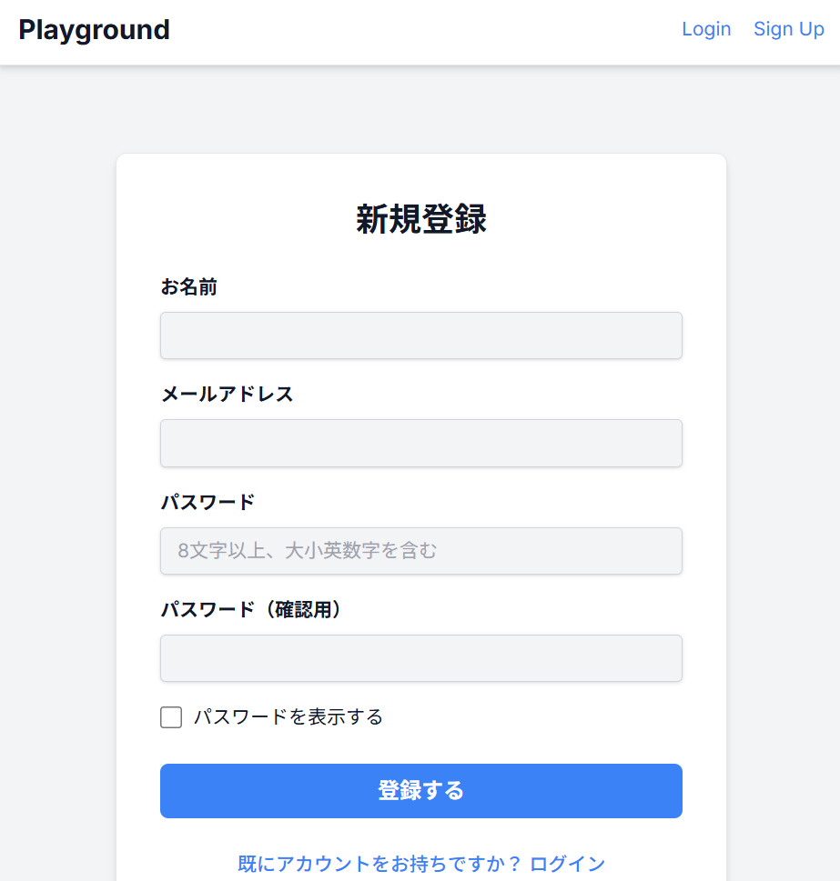
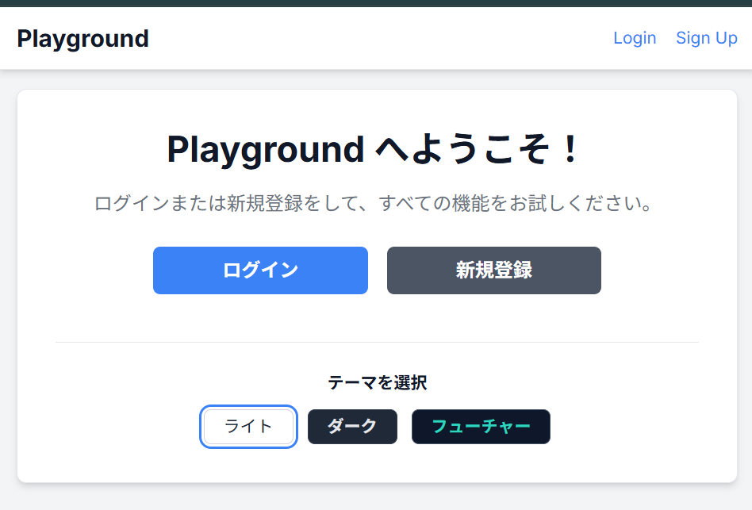
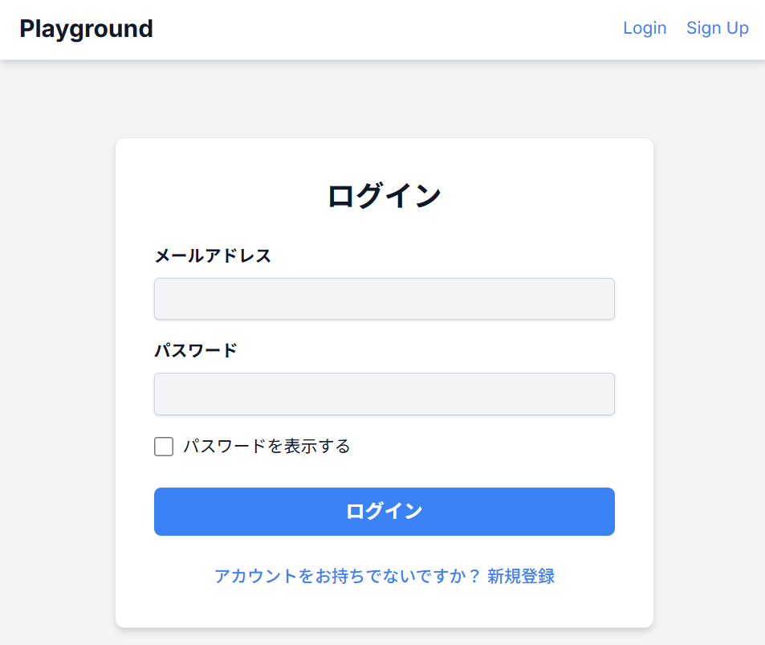
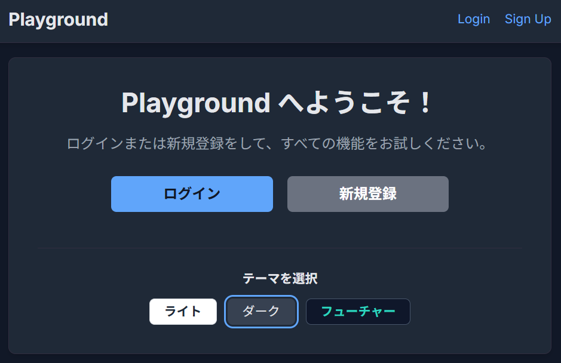
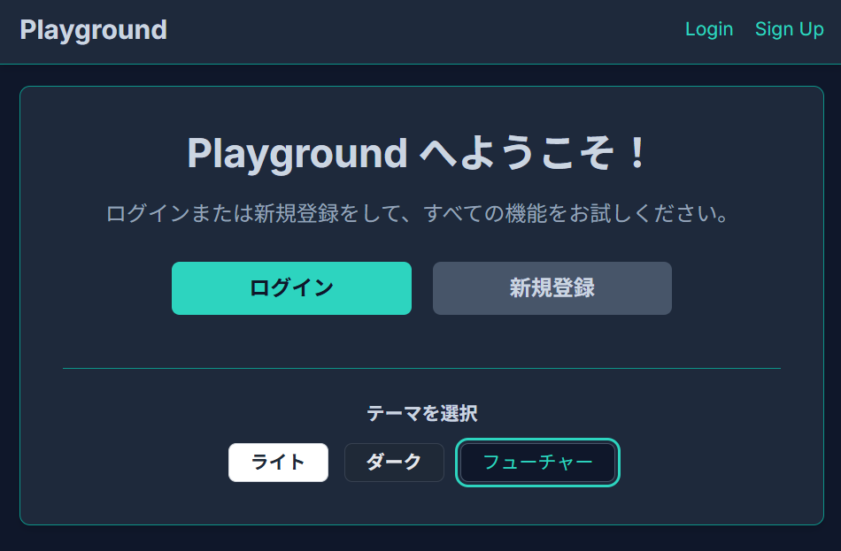
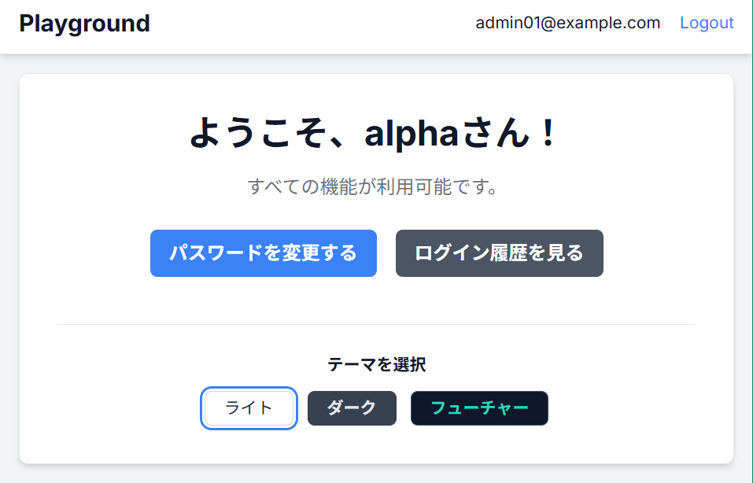
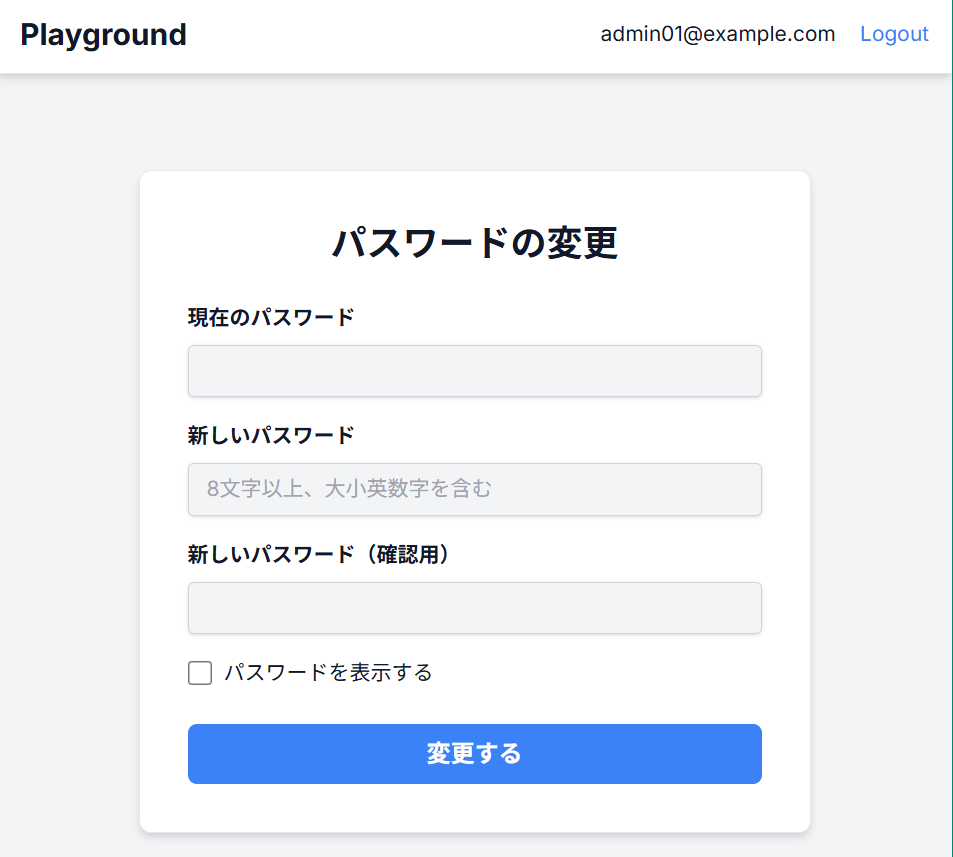
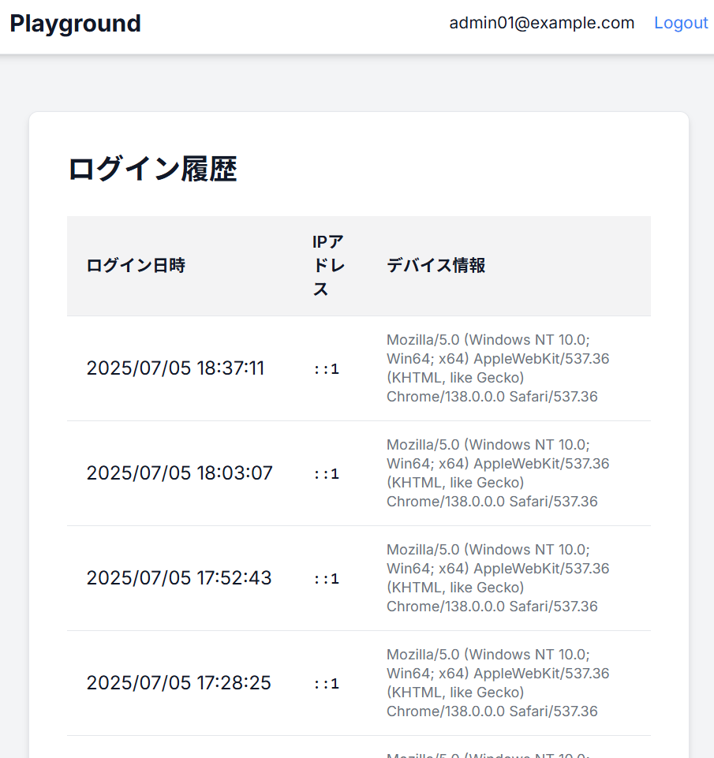

# Playground - 認証機能付きWebアプリケーション

## 概要

- 本プロジェクトでは、Next.js, TypeScript, Prismaを用いて、セキュアな認証・認可機能を持つWebアプリケーションの開発を行った。
- 基本的なユーザー認証に加え、ブルートフォース攻撃対策としてのアカウントロック機能、不正アクセスを早急に対処するためのログイン履歴の一覧確認、パスワードやテーマカラーの変更機能など、さまざまな機能を追加実装した。
- 認証方式には、トークンベース認証を採用した。

## 目次

- [機能詳細](#機能詳細)
    - [ユーザー登録機能 (サインアップ)](#ユーザー登録機能)
    - [ログイン・ログアウト機能](#ログイン・ログアウト機能)
    - [パスワードの表示・非表示切り替え機能](#パスワードの表示・非表示切り替え機能)
    - [テーマカラー変更機能 (ライト/ダーク/フューチャー)](#テーマカラー変更機能)
    - [ログイン後のリダイレクト機能](#ログイン後のリダイレクト機能)
    - [連続ログイン失敗によるアカウントロック機能](#連続ログイン失敗によるアカウントロック機能)
    - [パスワード変更機能](#パスワード変更機能)
    - [ログイン履歴の表示機能](#ログイン履歴の表示機能)
- [使用技術](#使用技術)

## 機能詳細

### ユーザー登録機能

- メールアドレス、名前、パスワードを用いて新規ユーザー登録を行う。
- メールアドレスの形式やパスワードの強度 (8文字以上、大小英数字を含む) を検証する。
- 登録済みのメールアドレスが使用された場合、エラーメッセージを表示して再入力を促す。
- ユーザーの入力ミスを防ぐため、「パスワード（確認用）」フィールドを実装した。

|  |
| :---: |
| 新規登録画面 |

### ログイン・ログアウト機能
- 既に登録されたメールアドレス、パスワードを入力してアカウントにログインする。
- ヘッダーの右側のテキストや、メインページのログインボタンからリダイレクトすることができる。
- ログアウトはヘッダーの右側のテキストからのみできる。

|  |  |
| :---: | :---: |
| メインぺージ| ログイン画面|

### パスワードの表示・非表示切り替え機能

- 全てのパスワード入力ボックス (新規登録、ログイン、パスワード変更) に、入力内容の表示/非表示を切り替えるチェックボックスを実装した。
- ページ内の全てのパスワードフィールドに同時に適用される。

### テーマカラー変更機能

アプリケーションとしての魅力を高めるため、ライト・ダーク・フューチャーの3つのテーマを切り替える機能を実装した。

|   |  |  |
| :---: | :---: | :---: |
| ライトテーマ | ダークテーマ | フューチャーテーマ |

### ログイン後のリダイレクト機能

- 未ログイン状態でパスワード変更画面等の保護されたページにアクセスしようとすると、ログインページへリダイレクトする。
- ログイン成功後、メインページではなく、ユーザーが本来目的としていたページへ自動的にリダイレクトさせることで、スムーズな操作を実現している。

### 連続ログイン失敗によるアカウントロック機能

- ブルートフォース攻撃やパスワードリスト攻撃に対する耐性を向上させるため、5回連続で認証に失敗したアカウントを15分間ロックし、不正ログインを無効化する。

### パスワード変更機能

- パスワード変更APIでは、現在のパスワードが正しいことを検証した上で、新しいパスワードのハッシュ値をデータベースに保存する。
- このページは保護ルートとして設定されており、ログインしていないユーザーはアクセスすることができない。

|  |  |
| :---: | :---: |
| 認証後メインページ | パスワード表示機能 |

### ログイン履歴の表示機能

- ユーザーが自身のログイン履歴 (ログイン日時、IPアドレス、デバイス情報) を確認できる機能を実装した。
- このページも保護ルートとして設定されており、ログインしているユーザーが自身の履歴のみを閲覧できる。これにより、身に覚えのないアクセスがあった場合に、ユーザーが早期に気づくことができます。

|  |
| :---: |
| ログイン履歴画面|

## 使用技術

  - フレームワーク: Next.js 14 (App Router)
  - 言語: TypeScript
  - ORM: Prisma
  - スタイリング: Tailwind CSS
  - スキーマバリデーション: Zod
  - 認証 (JWT): jose
  - セキュリティ: bcrypt (パスワードハッシュ化)
  - 状態管理: React Context, SWR
  - その他: Font Awesome (アイコン)
